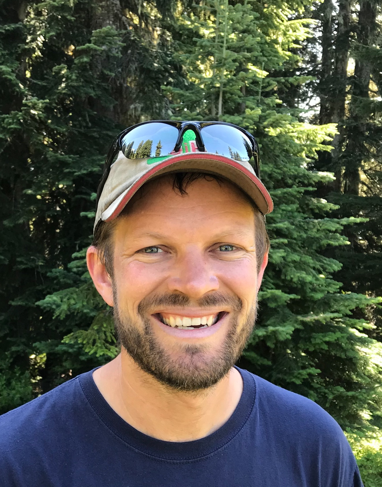

## Principal Investigator

::: {.grid}

::: {.g-col-12 .g-col-md-3}
{.img-fluid style="border-radius: 8px;"}
:::

::: {.g-col-12 .g-col-md-9}
### Zack Steel
**Principal Investigator**

Zack is a Research Ecologist with the Forest Service, Rocky Mountain Research Station in Fort Collins, CO and an Affiliate Faculty at Colorado State University. He is interested all things forest disturbance, and wildlife, especially western forests, birds, and bats.    

Email: zachary.steel[at]usda.gov &nbsp;·&nbsp;
<!-- [Email](mailto:you@university.edu) &nbsp;·&nbsp; -->
[Google Scholar](https://scholar.google.com/citations?user=HQaJ7J0AAAAJ&hl=en&oi=sra) &nbsp;·&nbsp;
[Forest Service Profile](https://research.fs.usda.gov/about/people/zachary.steel) &nbsp;·&nbsp;
:::

:::

## Current Researchers

::: {.grid}

::: {.g-col-12 .g-col-md-3}
{.img-fluid style="border-radius: 8px;"}
:::

::: {.g-col-12 .g-col-md-9}
### Leah McTigue
**Research Associate** (started 2023)

[A few sentences on their project or research interests.]
:::

::: {.grid}

::: {.g-col-12 .g-col-md-3}
{.img-fluid style="border-radius: 8px;"}
:::

::: {.g-col-12 .g-col-md-9}
### Hailey Boone
**Postdoctoral Researcher** (started 2025)

[A few sentences on their project or research interests.]
:::

:::

*Copy the block above for each additional student, postdoc, or staff member.*

## Lab Alumni

::: {.grid}

::: {.g-col-12 .g-col-md-3}
{.img-fluid style="border-radius: 8px;"}
:::

::: {.g-col-12 .g-col-md-9}
### Merijn van den Bosch
**Postdoctoral Researcher** - now [current position]

:::
