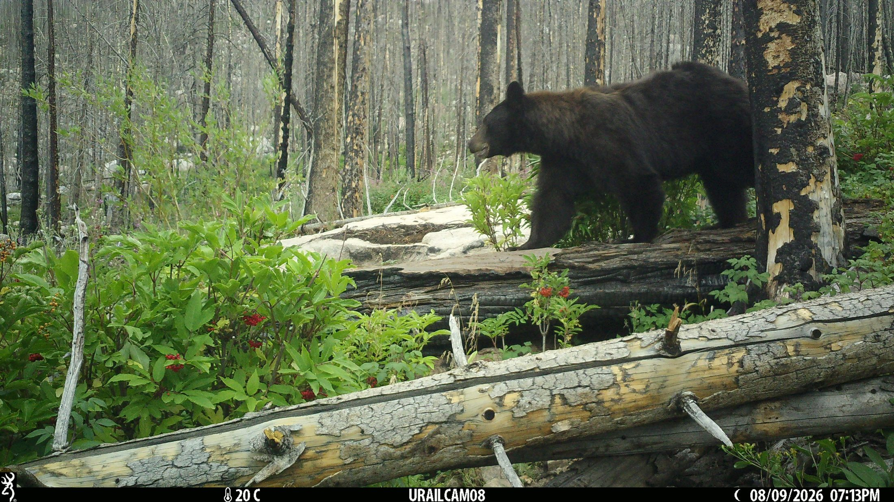
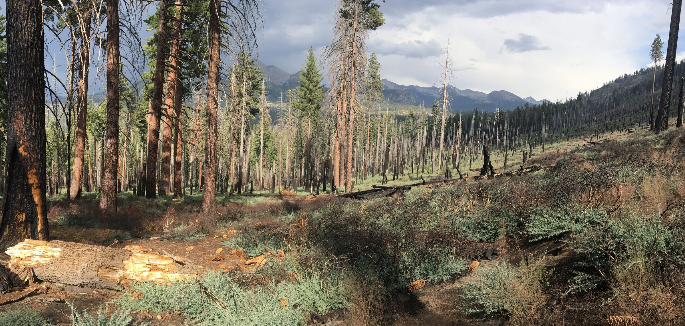
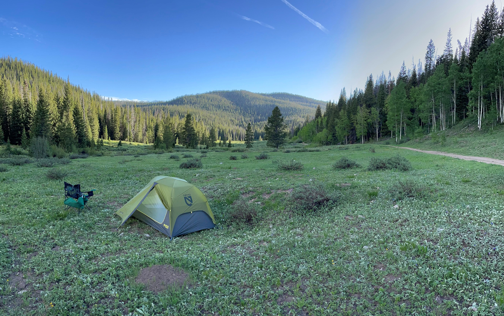
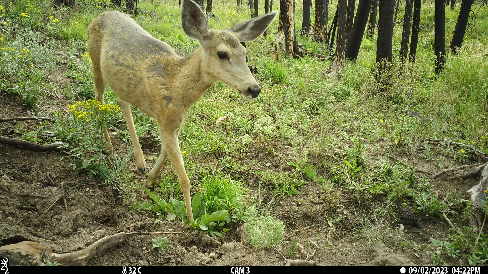

## Overview

Our research focuses on understanding how biodiversity and ecosystem function respond to natural and anthropogenic disturbances, including fire, drought, and land use change. We use a combination of field studies, spatial analyses, and modeling approaches to address questions related to wildlife response to change, forest resilience, and biodiversity conservation in the face of global change. Our work is motivated by the need to inform management and policy decisions that promote sustainable ecosystems and biodiversity conservation.

## Projects

<!-- ===================================================================
     Each project below becomes a clickable tile. Clicking a tile, or the
     Previous / Next buttons under a project, swaps which project is shown,
     so visitors never have to scroll past one project to reach the next.
     Tiles appear in the same order as the projects below.

     To add a project, copy one block: a ### heading, one image, and a
     paragraph. Put the image first; a caption in the [brackets] shows
     under it. Optional extras in the {braces} after the heading:

       #some-id     link straight to the project: research.html#some-id
       short="..."  a shorter title for the tile (default: the heading)
       thumb="..."  a different picture or icon for the tile
                    (default: the project's own image)

     Project-specific photos can go in images/research/.
     =================================================================== -->

::: {#research-projects}

### Disturbance impacts on wildlife {#wildlife-disturbance short="Wildlife & disturbance"}

Our ecosystems are dynamic and constantly changing, and disturbances such as wildfire, insect outbreaks, active management, and drought can have important impacts on wildlife populations. We study how these disturbances impact biodiversity, wildlife community composition, and species occurrence, with a focus on understanding the mechanisms driving these changes. By integrating field observations, remote sensing data, and ecological modeling, we aim to inform conservation strategies that enhance ecosystem resilience and biodiversity.

### Forest and fire ecology {#fire-ecology short="Forest & fire ecology"}

Fire across the globe and the western United States is changing in frequency, severity, and extent. We study how fire regimes are changing across western forests, how ecosystems recover from (or don't) severe disturbance, and how these changes impact wildlife populations. This work emphasizes landscape ecology concepts including the pyrodiversity hypothesis that posits varied fire patterns support biodiversity through the creation of varied ecological niches across space and time.

### Global change and biodiversity trends {#biodiversity-trends short="Biodiversity trends"}

Biodiversity of many taxa and geographies are in decline due to a combination of local and global threats. We seek to quantify how, where and for whom declines are occurring using long-term monitoring data, citizen science data, and remote sensing data. We also seek to understand the mechanisms driving these declines and their geographic patterns across North America.

### Innovative wildlife monitoring methods {#wildlife-monitoring short="Wildlife monitoring"}

[A paragraph describing this project.]

:::

<!-- ## Funding -->

<!-- *List current and past grants supporting the lab's work, e.g.:* -->

<!-- - **[Funding Agency]**, [Grant Title], [Award Number], [Years] -->
